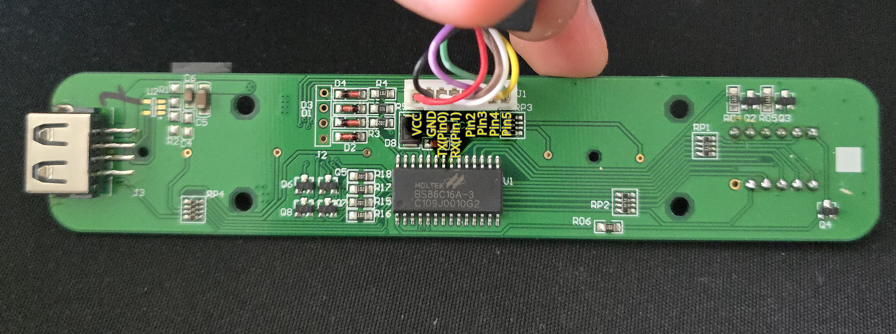

# Jiecang Handset Controller

Rust library for using Jiecang JCHT35K-style standing desk handsets.

This project was tested with a Jiecang `JCHT35K9` handset from an IKEA UPPSPEL desk. Other JCHT35K handsets should be similar, but they are not guaranteed.

The repo root is the reusable `jiecang-handset-controller` crate. It is intentionally platform-independent: it does not know about ESP GPIO pins, UART peripherals, interrupts, channels, timers, or Embassy tasks. The example firmware adapts ESP32-C6 pins and UART to the library API.

## Workspace

```text
src/                            no_std library
examples/esp-handheld-uart      ESP32-C6 demo firmware package
```

## Adding The Library

Rust project can add it directly from GitHub:

```toml
[dependencies]
jiecang-handset-controller = { git = "https://github.com/kralonur/jiecang-handset-controller.git" }
```

## Current Scope

The library currently covers only the handset side:

- display packets sent to the handset display
- physical button-line decoding for the 4 active-low handset lines
- pressed/released edge tracking
- typestate builder API so clients can opt into display support, button support, or both

It does not cover the desk control-box side of things and does not implement desk movement commands. This project is only for using the handset: sending packets to its display and decoding its button lines.

## Library Usage

Default controller with display and buttons:

```rust
use jiecang_handset_controller::{ButtonEvent, ButtonLines, Controller};

let mut controller = Controller::default();

let packet = controller.height(700);
assert_eq!(packet, [0x01, 0x01, 0x02, 0xbc]);

let lines = ButtonLines {
    pin2_low: false,
    pin3_low: false,
    pin4_low: false,
    pin5_low: true,
};

let event = controller.update_buttons(lines);
assert_eq!(event, Some(ButtonEvent::Pressed(jiecang_handset_controller::Button::Up)));
```

Display-only clients can avoid the button API:

```rust
use jiecang_handset_controller::Controller;

let controller = Controller::display_only();
let packet = controller.reset();
```

Button-only clients can avoid the display API:

```rust
use jiecang_handset_controller::{ButtonEvent, ButtonLines, Controller};

let mut controller = Controller::buttons_only();
let event = controller.update_buttons(ButtonLines::new(false, false, true, false));
assert_eq!(event, Some(ButtonEvent::Pressed(jiecang_handset_controller::Button::Down)));
```

Explicit builder:

```rust
use jiecang_handset_controller::Controller;

let controller = Controller::builder()
    .with_display()
    .with_buttons()
    .build();
```

## Hardware Pinout

The tested JCHT35K9 handset PCB pinout is shown below:



The connector labels used while testing were:

| Connector label | Meaning                                                                                                |
| --------------- | ------------------------------------------------------------------------------------------------------ |
| `VCC`           | handset supply                                                                                         |
| `GND`           | ground                                                                                                 |
| `TX(Pin0)`      | handset UART transmit line; not used because this library does not send desk controls from the handset |
| `RX(Pin1)`      | handset UART receive line; connect the microcontroller TX line here to send display packets            |
| `Pin2`          | button input line                                                                                      |
| `Pin3`          | button input line                                                                                      |
| `Pin4`          | button input line                                                                                      |
| `Pin5`          | button input line                                                                                      |

## Button Decoding

The firmware owns the real pins. It reads whatever hardware it uses and passes logical active-low line states into the library:

```rust
ButtonLines {
    pin2_low: pin2.is_low(),
    pin3_low: pin3.is_low(),
    pin4_low: pin4.is_low(),
    pin5_low: pin5.is_low(),
}
```

Current mapping:

| `pin2_low` | `pin3_low` | `pin4_low` | `pin5_low` | Button |
| ---------- | ---------- | ---------- | ---------- | ------ |
| false      | false      | false      | false      | none   |
| false      | false      | false      | true       | up     |
| false      | false      | true       | false      | down   |
| false      | false      | true       | true       | M1     |
| false      | true       | false      | false      | M2     |
| false      | true       | true       | false      | M3     |
| false      | true       | false      | true       | M4     |
| true       | false      | false      | false      | rec    |

Anything else is reported as `ButtonReading::Unknown(mask)`. We are not implementing multi-button combos for now because the controller behavior we need only uses the documented single-button states.

## Display Packets

The display API returns raw bytes and leaves transmission to the caller.

These packets are the compact controller-to-handset display messages used by this handset family. They are shaped as:

```text
0x01 COMMAND ARG0 ARG1
```

| API                                 | Packet                     |
| ----------------------------------- | -------------------------- |
| `reset()`                           | `[0x01, 0x04, 0x01, 0xaa]` |
| `height(mm)`                        | `[0x01, 0x01, hi, lo]`     |
| `error(E01..E08)`                   | `[0x01, 0x02, bit, 0x00]`  |
| `error(H01)`                        | `[0x01, 0x02, 0x00, 0x10]` |
| `error(E13)`                        | `[0x01, 0x02, 0x00, 0x40]` |
| `error(LOC)`                        | `[0x01, 0x02, 0x00, 0x80]` |
| `program(Pending/Preset1..Preset4)` | `[0x01, 0x06, bit, 0x00]`  |

The command bytes match the Uplift-style controller display messages documented in Jarvis: height `0x01`, error `0x02`, reset `0x04`, and programming `0x06`.
Hardware probing found second-argument values `0x10` displays `H01`, `0x40` displays `E13`, and `0x80` displays `LOC`.

The ESP demo repeatedly writes these packets over UART at 9600 baud.

## ESP Demo Behavior

The demo firmware uses GPIO2, GPIO3, GPIO4, and GPIO5 as active-low inputs for the handset button lines, and UART1 TX on GPIO16 for display output.

The demo currently:

- shows reset first
- shows a starting height after the reset period
- increases/decreases height with up/down
- arms memory programming with rec
- stores current height with rec followed by M1..M4
- recalls saved heights with M1..M4
- shows E01..E04 when a requested memory slot is empty

The stored memory values are demo state in firmware RAM, not non-volatile storage yet.

## Credits

Special thanks to [phord/Jarvis](https://github.com/phord/Jarvis). Its reverse-engineering notes document the controller-to-handset display messages and button-line observations that helped confirm the packet bytes and mappings used here.
